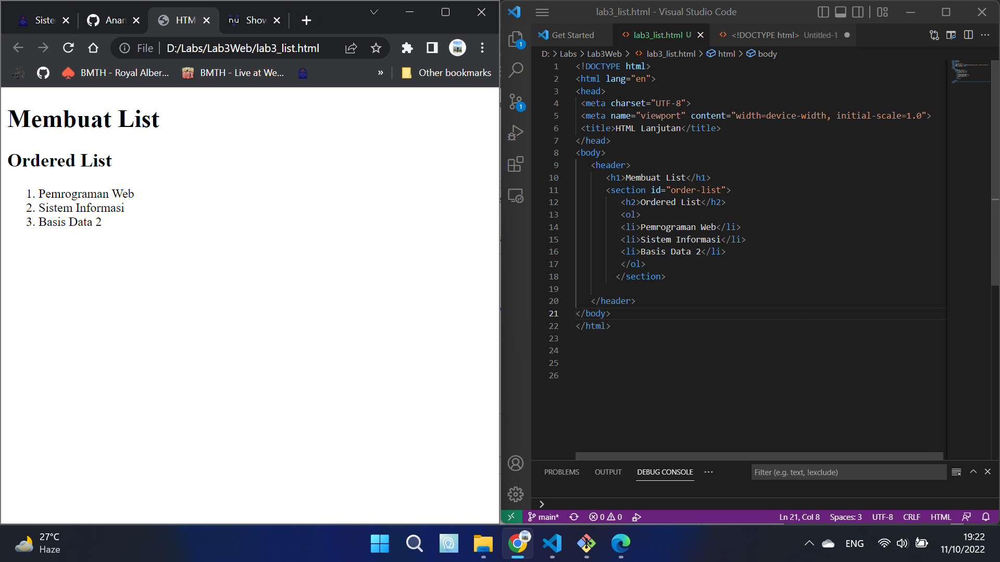
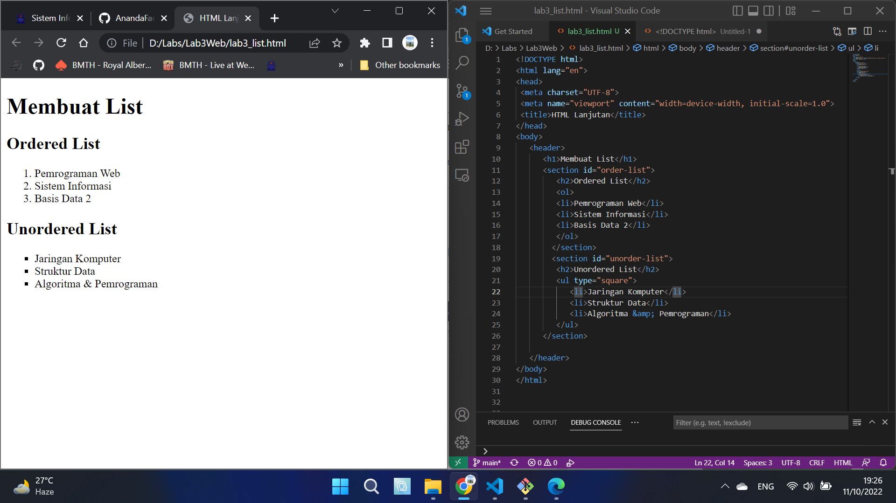
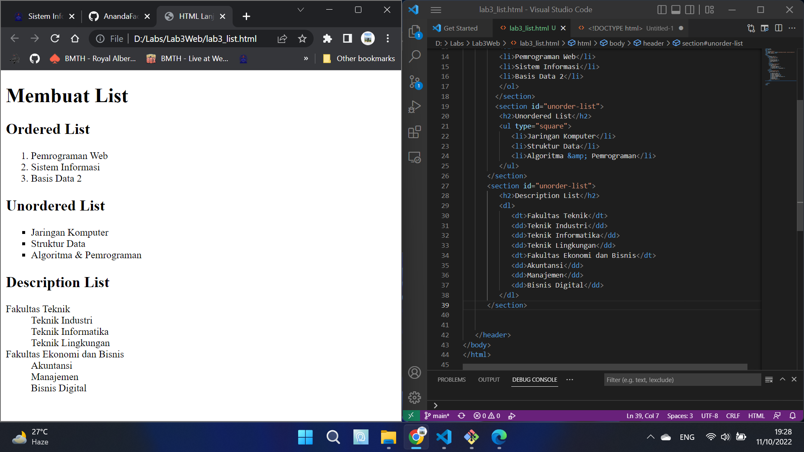
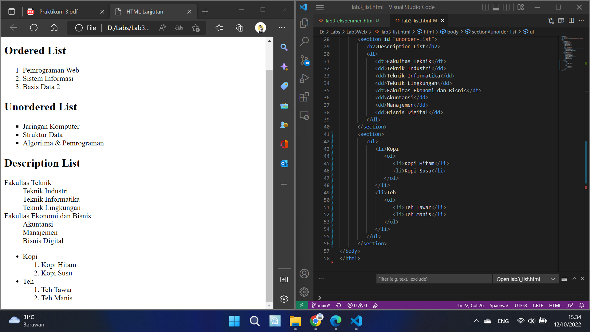
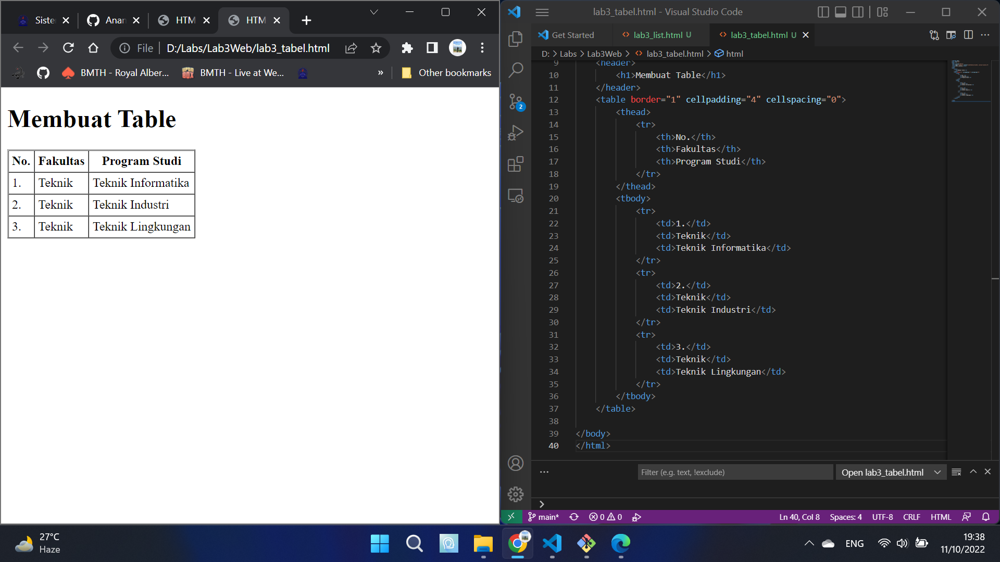
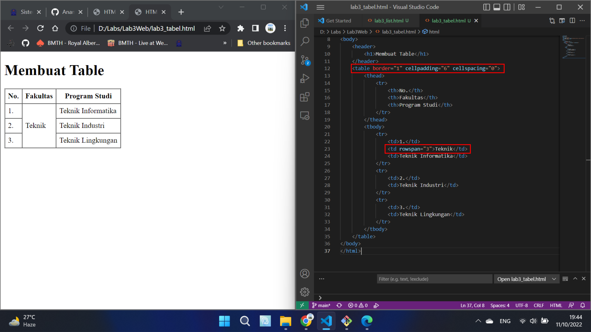
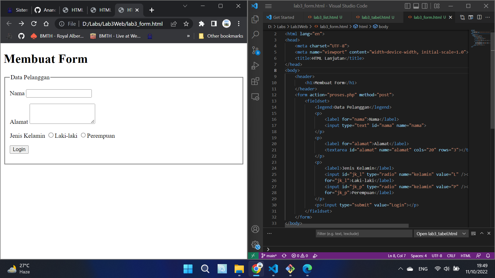
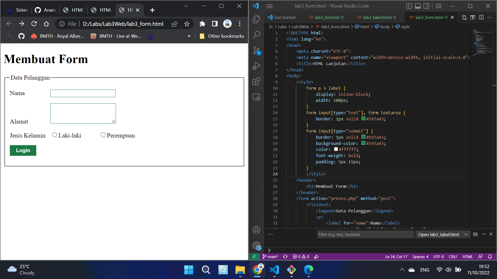

# Lab3Web
## Ananda Fachri Reynaldi
## 312110248
## TI.21.B1

### Membuat File HTML List
1. Membuat Ordered List

2. Membuat Unordered List

3. Membuat Description List

3. Membuat Eksperimen Pada Dokumen List

### Membuat File HTML Table
5. Membuat Table

6. Menggabungkan Sel Data Menggunakan Atribut Rowspan dan Mengatur Cellpading  

### Membuat File HTML Form
7. Membuat Form Sederhana

8. Menambahkan Style Pada Form
